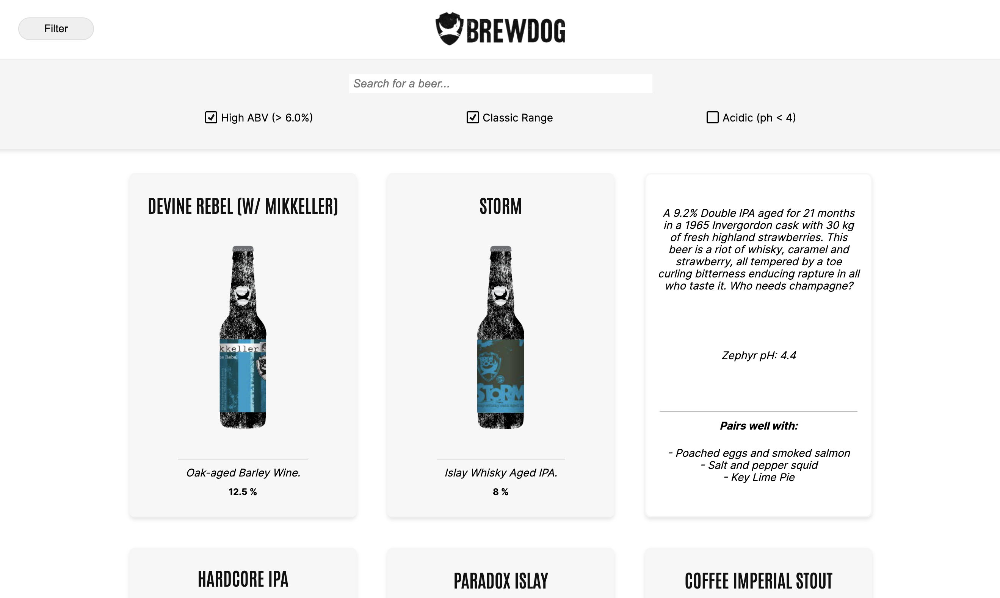
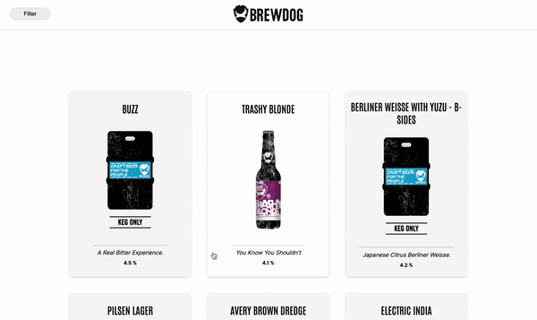

# BrewDog Punk API React App

> _To build a website in React that uses the Punk API data. This application should display a full range of BrewDog beers and allow the user to easily search and filter by selected criterias and names._  

#### Project Link [_here_](https://amiehannah.github.io/punk-api/).

##

## Table of Contents

- [User Story](#user-story)
- [Installation and Setup](#installation-and-setup)
- [Approach & Functionality](#approach--functionality)
- [Fetching data from the API](#fetching-data-from-the-api)
- [Technologies & Features](#technologies--features)
- [Unit Testing](#unit-testing)
- [Further Developments](#further-developments)
- [Contact](#contact)

## User Story:

- As a user of the Punk API website, I want to be able to easily browse through a range of BrewDog beers, so that I can select the most suitable beer to use.

- Given that I am on the app and I do not click on a filter or search for a specific beer via the search bar, then I would like to be able to see **_all_** of the beers available.
- Given I am on the app and want to find out more information on a specific beer, when I click on a beer card, then I would like to be able to see information displayed about that beer (e.g. description, pH level, food pairing suggestion)
- Given I am on the app and want to search for a specific beer, when I type into the search bar, then I expect to see the chosen beer displayed on screen if it is present in the BrewDog back catalogue.
- Given I am on the app and want to filter by a specific condition (either: **_High Alcohol content_** (ABV value greater than 6%) - OR - **_Classic Range_** (was first brewed before 2010) - OR - **_High Acidity_** (pH lower than 4)), when I select a checkbox, then I expect to see beers returned that meet that criteria.
- Given I am on the app and want to filter by multiple search criteria, when I check multiple checkboxes in the filter menu, then I expect to see the beers that meet those specific criterias displayed on the page.
- Given I am on the app and no beers are found that meet the inputted search criteria that I have typed into the search bar, then I expect to see some feedback with an error message displayed on the page.
- Given I am on the app and no beers are found that meet the conditions of the selected checkboxes, then I expect to see some feedback with an error message displayed on the page.

 

    <b><a href="#"> ^ back to top</a></b>

 

##

  

## Installation and Setup:

Clone down this repository. You will need `node` and `npm` installed globally on your machine.
`git clone https://github.com/amiehannah/punk-api.git`

Installation:

`npm install`

To Start Server:

`npm start`

To Locally Run the App:

`http://localhost:3000/punk-api`

---

## Approach & Functionality:

1. Initially I started by breaking down the webpage, creating the components based on a component tree.

2. I also tested out the data (to later be imported via an API request). I used **_Postman_** to understand which data structures had been used to store the beer information and how I can later access certain bits of information from the data.

3. Display a range of beers  
   I chose to display the range of beers using card components. Using the React hook `useState`, I set state to an `onClick` event on the card component. I was able to flip the cards, enabling the user to see more information for each beer on the front and back of each card.

4. To make it clear for the user where to 'Filter' the beers, I added a button, which triggered a **_state_** change - toggling open/close the NavBar component.

5. Housed within this was the Searchbar and checkbox filters.  
   To add functionality to the Searchbar and allow the user to search for a specific beer I set the `onChange` event to **_state_** (i.e. when an input is added to the Searchbar), capture the value inside of the input box and use that to **_filter_** the beers, re-rendering the card components on the page based on the search term.

6. Filter Functionality  
   To use the checkboxes to filter by the three conditions **_(highABV, Classic Range, pHLevel)_** I created three individual states. I added an `onClick` event to each checkbox that toggled each change in state, dependent on which box had been clicked.

7. Interaction with the API  
   According to the punk `API` docs, you can apply several filters using **_url parameters_** (passed in as a query string to the end of the root endpoint), so I could use the API's data to filter for both:
   • High Alcohol content (ABV value greater than 6%)
   • Classic Range (was first brewed before 2010)

8. Saving each unique end point in a variable, I could use a `ternary operator` to render the specific filtered beers based on whether the state for each was set to true. Either returning the unique end-points that would be added onto the end of the `fetch` request(for all beers) or returning a blank string (i.e. state set to false so rendering all beers (the default state set in the `useEffect`)). To apply more than one filter to the data, I worked out that by tweaking where the punctuation was inside the fetch URL, I could **_chain the parameters together in the fetch request_** (returning both beers with highABV values and those in the classic range).

9. There was no predetermined filter for the **_pHLevel_** search condition, so I had to manually filter beers returning those that contained a pHLevel less than 4. I then conditionally rendered the beers based on whether the acidicBeer state was true (display only those beers that have a pHLevel < 4) or false (instead displaying all beers on the page). 
   Mapping over the data and rendering a card for each beer.

## Fetching data from the API:

- Using the Punk API data for the React app, calling the `API`, getting the response back - which is a `json` array with a number of beer objects inside and then setting that response to `state`.  
  Default state for the API request was set to return all beers from the Brewdog data.
- As recommended by the React docs - I extracted the `fetch` request into a `service` (as it is non UI based) and importing it into `App.jsx`
- As fetching data from an API produces a side-effect, I've used a `useEffect` to manage this.

//All beer endpoints return a json array with a number of beer objects inside.
//how to interact with the beer object and select the bits of information that you want to display to the user

## Technologies & Features:

- React.js
- REST API interaction
- Unit Tested using Jest & Enzyme
- Mobile first / responsive design
- Git Version Control
- `useState Hook`
- `useEffect Hook`
- `props`

## Unit Testing:

- Unit tested the components using the enzyme testing library.
  I've tested for the following things:
- Basic rendering, including rendering nested child components.
- Testing state changes on components and the associated side effect/behaviours
- Testing props have been successfully passed down to components
- Using mock functions to test my functions.

## Further Developments:

- To refactor my approach, ensuring I adhere clearly to the Container/Component Design Pattern splitting out logic from presentational components.
- Introduce unit testing using React Testing Library.

## Contact

Created by [Amie Edwards](mailto:amie.edwards17@gmail.com)
